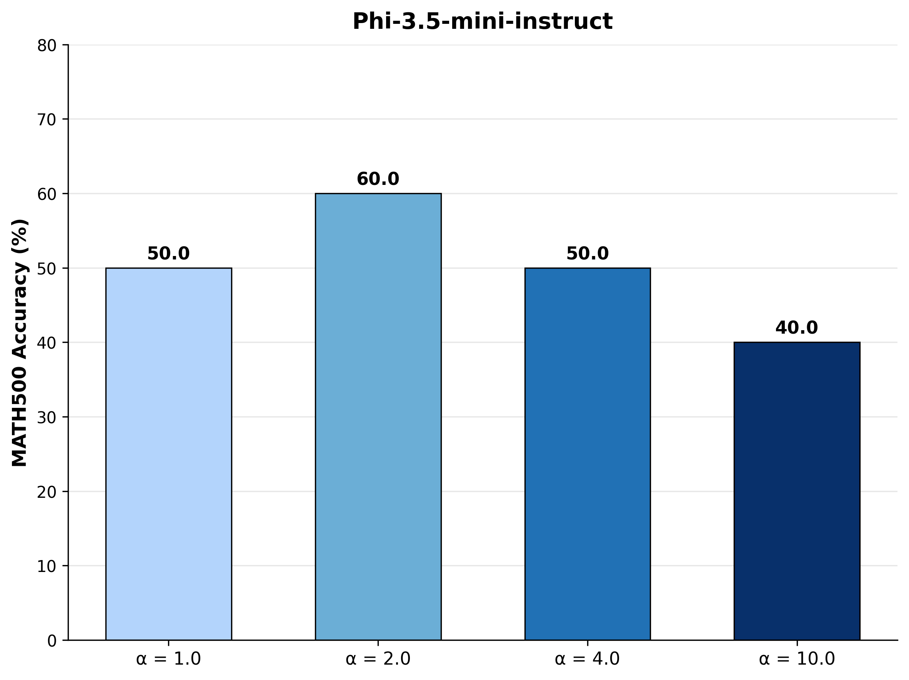

# Reasoning with Sampling — Reproduction Experiments

### [Paper](https://arxiv.org/abs/2510.14901) | [Project Page](https://aakaran.github.io/reasoning_with_sampling/)


This repo reproduces the power sampling experiments from "Reasoning with Sampling" on MATH500 and HumanEval benchmarks using Phi-3.5-mini-instruct.


## Prerequisites

- Linux (Ubuntu/Onyxia/SSPCloud)
- GPU with CUDA (recommended: 16GB+ VRAM)
- Python 3.11+
- `uv` package manager

**Check GPU availability:**
```bash
nvidia-smi
```

---

## 1) Install uv (if not already installed)
```bash
curl -LsSf https://astral.sh/uv/install.sh | sh
```

Reload your shell, then verify:
```bash
uv --version
```

---

## 2) Setup Project

Clone and enter the project:
```bash
git clone https://github.com/ayman-orkhis/GenAI_Reasoning_with_sampling.git
cd GenAI_Reasoning_with_sampling/llm_experiments
```

Install dependencies:
```bash
uv sync
```

---

## 3) Run Experiments

### Experiment 2: Effect of α (Alpha Sweep)

Run power sampling for different values of α on MATH500:
```bash
# α = 1.0 (baseline, temperature = 1.0)
uv run python power_samp_math.py --model phi --temperature 1.0 --mcmc_steps 5 --batch_idx 0

# α = 2.0 (temperature = 0.5)
uv run python power_samp_math.py --model phi --temperature 0.5 --mcmc_steps 5 --batch_idx 0

# α = 4.0 (temperature = 0.25)
uv run python power_samp_math.py --model phi --temperature 0.25 --mcmc_steps 5 --batch_idx 0

# α = 10.0 (temperature = 0.1)
uv run python power_samp_math.py --model phi --temperature 0.1 --mcmc_steps 5 --batch_idx 0
```

**Mapping α ↔ temperature:**
| α | --temperature |
|---|---------------|
| 1.0 | 1.0 |
| 2.0 | 0.5 |
| 4.0 | 0.25 |
| 10.0 | 0.1 |

---

## 4) Plot Results

After running the experiments, generate the figure:
```bash
uv run python plot_alpha_sweep.py
```

Output: `Results/phi_figure6_style.png`



---

## 5) Results Structure
```
llm_experiments/
├── results/phi/
│   ├── phi_math_base_power_samp_results_5_1.0_0_0.csv   # α=1.0
│   ├── phi_math_base_power_samp_results_5_0.5_0_0.csv   # α=2.0
│   ├── phi_math_base_power_samp_results_5_0.25_0_0.csv  # α=4.0
│   └── phi_math_base_power_samp_results_5_0.1_0_0.csv   # α=10.0
├── Results/
│   └── phi_figure6_style.png                            # Generated figure
└── plot_alpha_sweep.py                                  # Plotting script
```

---

## 6) Our Results (Experiment 2)

| α | Our Accuracy | Paper Reference |
|---|-------------|-----------------|
| 1.0 | 50.0% | 38.4% |
| **2.0** | **60.0%** | 48.2% |
| 4.0 | 50.0% | 50.8% |
| 10.0 | 40.0% | 48.2% |

Best performance at **α = 2.0**, consistent with the paper's finding that intermediate α values work best.

---

## Troubleshooting

**CUDA out of memory:**
```bash
# Reduce batch size or number of questions
uv run python power_samp_math.py --model phi --temperature 0.25 --mcmc_steps 5 --batch_idx 0
```

**Check transformers version (if DynamicCache error):**
```bash
uv run python -c "import transformers; print(transformers.__version__)"
# If issues, downgrade:
uv add transformers==4.44.0
```